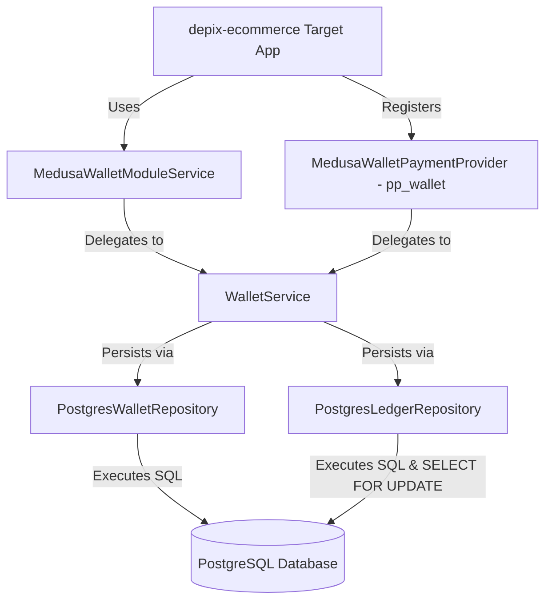

# Wallet AI Implementation Guide & Authoritative Integration Contract

> **Authoritative Contract for AI Coding Agents**
> This document is the single source of truth and integration guide for any AI Coding Agent integrating the Wallet Ecosystem packages into the target `depix-ecommerce` Medusa v2 store application.
> While this document serves as the authoritative guide for AI receiving agents, the actual source code and public TypeScript package exports in `payment-platform-monorepo` remain the ultimate ground truth for implementation behavior and API signatures.

---

## A. Purpose and Repository Boundaries

### Repository Ownership Split

This monorepo (`payment-platform-monorepo`) and the consumer application (`depix-ecommerce`) have strict ownership boundaries:

| Repository                             | Responsibility & Ownership                                                                                                                                                                                                                                       | Permitted Changes                                                                                        |
| :------------------------------------- | :--------------------------------------------------------------------------------------------------------------------------------------------------------------------------------------------------------------------------------------------------------------- | :------------------------------------------------------------------------------------------------------- |
| **`payment-platform-monorepo`**        | Owns core domain aggregates (`Wallet`, `Money`, `LedgerAccount`, `LedgerTransaction`), exact minor-unit math, double-entry ledger rules, PostgreSQL persistence repositories, schema migrations, and Medusa adapters (`pp_wallet`, `MedusaWalletModuleService`). | Wallet domain rules, persistence schema, repository interfaces, and wallet monorepo packages.            |
| **`depix-ecommerce`** _(Consumer App)_ | Owns Medusa v2 store configuration, cart/checkout workflows, store/admin REST routes, customer session authentication, dependency injection container wiring, and Medusa DB migrations.                                                                          | Medusa module registration, payment provider setup, API routes, DTOs, and store UI/frontend integration. |

_Rule for Receiving Agent:_ Never modify wallet monorepo code from inside `depix-ecommerce`. If a bug or missing capability is discovered in `@amirhossein-moloki/wallet-core` or `@amirhossein-moloki/wallet-persistence-postgres`, document and report the required change separately.

---

## B. Verified Architecture

### Dependency Graph & Boundaries

```text
                  depix-ecommerce (Medusa v2 Application)
                                     │
                 ┌───────────────────┴───────────────────┐
                 ▼                                       ▼
    Medusa Container / Module               Medusa Payment Provider (`pp_wallet`)
 (MedusaWalletModuleService)               (MedusaWalletPaymentProvider)
                 │                                       │
                 └───────────────────┬───────────────────┘
                                     │
                                     ▼
                      @amirhossein-moloki/wallet-core
                                     │
                                     ▼
                @amirhossein-moloki/wallet-persistence-postgres
                                     │
                                     ▼
                            PostgreSQL Database
```



---

## C. Integration Contract

### 1. Payment Provider Contract (`MedusaWalletPaymentProvider`)

Registered under identifier `pp_wallet` (`MedusaWalletPaymentProvider.PROVIDER_ID = 'pp_wallet'`).

```typescript
import { WalletService, Money } from '@amirhossein-moloki/wallet-core';

export class MedusaWalletPaymentProvider {
  public static readonly PROVIDER_ID = 'pp_wallet';
  public readonly identifier = 'pp_wallet';

  constructor(walletService: WalletService);

  // 1. Check customer wallet balance before payment session authorization
  public initiatePayment(input: {
    amount: number | bigint;
    currency_code: string;
    customer_id?: string;
    wallet_id?: string;
    context?: Record<string, unknown>;
  }): Promise<{
    status: 'pending' | 'error';
    data: Record<string, unknown>;
    error?: string;
  }>;

  // 2. Execute double-entry ledger debit for checkout
  public authorizePayment(
    paymentSessionData: Record<string, unknown>,
    idempotencyKey: string,
    orderId: string,
  ): Promise<{
    status: 'authorized' | 'error';
    data: Record<string, unknown>;
    error?: string;
  }>;

  // 3. Confirm captured payment
  public capturePayment(paymentData: Record<string, unknown>): Promise<{
    status: 'captured';
    data: Record<string, unknown>;
  }>;

  // 4. Cancel payment session
  public cancelPayment(paymentData: Record<string, unknown>): Promise<{
    status: 'canceled';
    data: Record<string, unknown>;
  }>;

  // 5. Refund payment by crediting customer wallet
  public refundPayment(
    paymentData: Record<string, unknown>,
    refundAmountMinor: bigint | number,
    reason: string,
    idempotencyKey: string,
  ): Promise<{
    status: 'captured' | 'error';
    data: Record<string, unknown>;
    error?: string;
  }>;
}
```

### 2. Module Service Contract (`MedusaWalletModuleService`)

Used within Medusa's dependency injection container:

```typescript
export class MedusaWalletModuleService {
  constructor(options: { walletService: WalletService });

  // Provision or retrieve customer wallet
  public getCustomerWallet(
    customerId: string,
    currency?: string, // Defaults to 'IRR'
  ): Promise<{ wallet: Wallet; balance: Money }>;

  // Read current balance
  public getWalletBalance(walletId: string): Promise<Money>;

  // Post verified top-up credit
  public topUpWallet(params: {
    walletId: string;
    amountMinor: bigint | number;
    currency: string;
    reference: string;
    idempotencyKey: string;
    metadata?: Record<string, unknown>;
  }): Promise<LedgerTransaction>;

  // Admin credit
  public adminCreditWallet(params: {
    walletId: string;
    amountMinor: bigint | number;
    currency: string;
    reason: string;
    adminId: string;
    idempotencyKey: string;
    metadata?: Record<string, unknown>;
  }): Promise<LedgerTransaction>;

  // Admin debit
  public adminDebitWallet(params: {
    walletId: string;
    amountMinor: bigint | number;
    currency: string;
    reason: string;
    adminId: string;
    idempotencyKey: string;
    metadata?: Record<string, unknown>;
  }): Promise<LedgerTransaction>;

  // Checkout debit
  public debitForCheckout(params: {
    walletId: string;
    amountMinor: bigint | number;
    currency: string;
    orderId: string;
    idempotencyKey: string;
    metadata?: Record<string, unknown>;
  }): Promise<LedgerTransaction>;
}
```

---

## D. Package Consumption

### Package Names & Distribution

Packages are distributed via **GitHub Packages** (`https://npm.pkg.github.com`):

- `@amirhossein-moloki/wallet-core`
- `@amirhossein-moloki/wallet-persistence-postgres`

### Target `.npmrc` Configuration

Ensure `depix-ecommerce` has `.npmrc` configured:

```ini
@amirhossein-moloki:registry=https://npm.pkg.github.com
//npm.pkg.github.com/:_authToken=${GITHUB_TOKEN}
```

### Target `package.json` Dependencies

```json
{
  "dependencies": {
    "@amirhossein-moloki/wallet-core": "^1.0.0",
    "@amirhossein-moloki/wallet-persistence-postgres": "^1.0.0",
    "pg": "^8.11.5"
  }
}
```

---

## E. Required Integration Workflow

Receiving AI coding agents in `depix-ecommerce` MUST execute integration in this exact 10-step sequence:

```text
Step 1: Inspect Target App & Medusa v2 Version
Step 2: Inspect Existing Payment Providers & Checkout Pipeline
Step 3: Install Wallet Packages via GitHub Packages
Step 4: Execute PostgreSQL Migrations (`DatabaseMigrator`)
Step 5: Register Medusa Wallet Module (`MedusaWalletModuleService`)
Step 6: Register Medusa Payment Provider (`pp_wallet`)
Step 7: Implement Authenticated Customer Balance API (`/store/me/wallet`)
Step 8: Implement Customer Top-Up Flow (Gateway -> Callback -> `topUpWallet`)
Step 9: Test E-Commerce Checkout with Wallet (`pp_wallet`)
Step 10: Run Verification Suite & Produce Evidence Report
```

### Detailed Steps:

1. **Inspect Target App & Medusa Version**: Confirm Medusa framework version (e.g., `@medusajs/framework` v2.x).
2. **Inspect Existing Payment Providers**: Check `medusa-config.ts` for registered payment providers and checkout handlers.
3. **Install Wallet Packages**: Run `pnpm add @amirhossein-moloki/wallet-core @amirhossein-moloki/wallet-persistence-postgres pg`.
4. **Execute Database Migrations**: Wire `DatabaseMigrator` into container startup or migration script to run `001_wallet_initial_schema.sql`.
5. **Register Medusa Wallet Module**: Create Medusa module file in `src/modules/wallet/index.ts` binding `MedusaWalletModuleService`.
6. **Register Payment Provider**: Register provider identifier `pp_wallet` mapped to `MedusaWalletPaymentProvider`.
7. **Implement Customer Balance Access**: Create endpoint `GET /store/me/wallet`. Derive `customer_id` from `req.auth_context.actor_id`. Never allow client-supplied customer IDs.
8. **Implement Online Top-Up Flow**:
   - Customer initiates gateway payment via `@amirhossein-moloki/payment-service` (`createPayment`).
   - Upon gateway callback verification (`verifyPayment`), invoke `walletModuleService.topUpWallet()` with `idempotencyKey` and `reference`.
9. **Integrate Store Checkout**:
   - Select `pp_wallet` at checkout.
   - Execute `initiatePayment()` and `authorizePayment()`.
   - On insufficient balance (HTTP 422), prompt user to top up or select an alternative payment method.
10. **Produce Verification Report**: Validate balance lookups, top-ups, checkout debits, duplicate retries, and error handling.

---

## F. Financial Invariants — Non-Negotiable

The receiving AI agent MUST preserve these financial invariants:

1. **Exact Integer Minor Units**: All money amounts MUST be represented in integer minor units using `bigint` (e.g. 500,000 IRR = 500,000 minor units). NEVER use floating-point numbers (`number` with decimals) for monetary calculations.
2. **Currency Consistency**: All entries in a ledger transaction and the target wallet MUST share the exact same uppercase currency code (e.g. `'IRR'`).
3. **Balanced Double-Entry Ledger**: Every posted ledger transaction MUST satisfy $\sum \text{DEBIT} = \sum \text{CREDIT}$.
4. **Immutable Posted History**: Posted ledger transactions and entries are strictly immutable. Correction or reversals MUST be made via new compensating ledger transactions.
5. **Durable Idempotency**: Financial operations (`topUpWallet`, `debitForCheckout`, `adminCreditWallet`, `adminDebitWallet`) REQUIRE non-empty idempotency keys. Re-sending the same idempotency key with an identical payload MUST return the cached transaction without re-executing debits or credits.
6. **Atomic Database Transactions & Deterministic Locking**: Persistence updates MUST execute inside a PostgreSQL transaction (`withTransaction`) with row-level locks on `ledger_accounts` sorted in ascending alphabetical order (`ORDER BY id ASC`).
7. **Customer Ownership Isolation**: Customer sessions MUST only access or debit wallets where `wallet.ownerId === customer_id`.
8. **Reconciliation**: System administrators can run `WalletReconciliationService.reconcile()` at any time to detect unbalanced transactions or stored balance projection drift.

---

## G. Payment and Accounting Semantics

### Operation Accounting Matrix

| Operation          | Debit Account                              | Credit Account                                  | Ledger Impact                                             |
| :----------------- | :----------------------------------------- | :---------------------------------------------- | :-------------------------------------------------------- |
| **Online Top-Up**  | `system-cash-account_<currency>` (Asset +) | `acc_bal_<walletId>` (Liability +)              | Cash received; customer liability increased.              |
| **Checkout Debit** | `acc_bal_<walletId>` (Liability -)         | `system-revenue-account_<currency>` (Revenue +) | Customer liability reduced; sales revenue recognized.     |
| **Admin Credit**   | `system-cash-account_<currency>` (Asset +) | `acc_bal_<walletId>` (Liability +)              | System grants stored value; customer liability increased. |
| **Admin Debit**    | `acc_bal_<walletId>` (Liability -)         | `system-cash-account_<currency>` (Asset -)      | System reclaims stored value; customer liability reduced. |

### Accounting Policy Flags for Business Review

1. **Refund Accounting Treatment**:
   - `refundPayment` currently invokes `adminCreditWallet`, which debits `system-cash-account` (Asset +) and credits customer wallet liability.
   - _Review Flag_: If store finance rules require debiting Sales Revenue or Sales Returns rather than Cash Asset during order refunds, notify the business team to introduce a dedicated order refund ledger method.
2. **Partial Refunds & Unresolved Failure Windows**:
   - Partial refunds pass custom `refundAmountMinor` to `refundPayment`.
   - If an external payment gateway top-up succeeds but local database persistence fails during top-up confirmation, the transaction rolls back safely. The reconciliation service (`WalletReconciliationService`) can be run to identify discrepancies.

---

## H. Known Limitations and Unverified Guarantees

| Feature / Scenario                                       | Status & Evidence Level                                                                              |
| :------------------------------------------------------- | :--------------------------------------------------------------------------------------------------- |
| **Exact Integer Arithmetic (`Money`)**                   | **VERIFIED** — Monorepo unit tests pass.                                                             |
| **Double-Entry Balancing**                               | **VERIFIED** — Monorepo unit tests pass.                                                             |
| **PostgreSQL Atomic Transactions**                       | **VERIFIED** — Tested via `pg-mem` emulator in monorepo.                                             |
| **Deterministic Locking (`SELECT FOR UPDATE`)**          | **EMULATED** — Tested in `pg-mem`; requires staging verification on physical PostgreSQL.             |
| **Customer Ownership Isolation (`pp_wallet`)**           | **VERIFIED** — Unit tests pass in `medusa-integration.spec.ts`.                                      |
| **Medusa v2 Container Integration in `depix-ecommerce`** | **UNVERIFIED** — Consumer repo is separate and not present in this workspace.                        |
| **Mixed Payment (Partial Wallet + External Gateway)**    | **UNSUPPORTED** — Medusa Payment Collections must split transactions into distinct payment sessions. |

---

## I. Safe AI Working Rules

Receiving AI coding agents MUST follow these mandatory rules:

1. **Rule 1 — Read Guide & Source First**: Inspect this guide and public package exports (`packages/wallet-core/src/index.ts`) before writing code.
2. **Rule 2 — Never Use Floats for Money**: Always convert prices to integer minor units (`bigint`).
3. **Rule 3 — Never Trust Client-Supplied Customer IDs**: Always derive `customer_id` from verified session tokens (`req.auth_context.actor_id`).
4. **Rule 4 — Never Bypass Idempotency**: Always pass unique, non-empty idempotency keys for top-ups, debits, and credits.
5. **Rule 5 — Never Mutate Posted Transactions**: Posted ledger transactions are immutable. Use compensating transactions for reversals.
6. **Rule 6 — Keep Database Updates Atomic**: Execute all ledger entries and account balance updates inside a single database transaction.
7. **Rule 7 — Never Log Secrets or Tokens**: Do not log database passwords, auth tokens, or customer credentials.
8. **Rule 8 — Check Balances Authoritatively**: Never rely on frontend balance state; always check balance via `walletService.getWalletBalance()` on the server.
9. **Rule 9 — Synchronize OpenAPI Specifications**: Update `openapi.yml` when adding or modifying wallet REST routes in `depix-ecommerce`.
10. **Rule 10 — Report Uncertainty Explicitly**: If accounting or Medusa integration rules are ambiguous, report them rather than making financial assumptions.

---

## J. Acceptance Checklist

The receiving AI agent MUST verify this checklist before completing integration in `depix-ecommerce`:

- [ ] `.npmrc` configured for `@amirhossein-moloki` scope on GitHub Packages.
- [ ] `@amirhossein-moloki/wallet-core` and `@amirhossein-moloki/wallet-persistence-postgres` installed.
- [ ] Database migrations executed via `DatabaseMigrator`.
- [ ] `MedusaWalletModuleService` registered in Medusa DI container.
- [ ] `MedusaWalletPaymentProvider` (`pp_wallet`) registered in Medusa payment configuration.
- [ ] Authenticated customer balance endpoint (`GET /store/me/wallet`) implemented using session `actor_id`.
- [ ] Customer top-up workflow implemented with verified gateway callbacks and idempotency keys.
- [ ] E-commerce checkout tested with `pp_wallet`.
- [ ] Insufficient balance handling (HTTP 422) verified.
- [ ] Duplicate request retries with same idempotency key verified.
- [ ] Customer isolation verified (cross-customer wallet access blocked).
- [ ] OpenAPI specification updated for new store/admin endpoints.
- [ ] Typecheck, lint, and unit/integration tests passing in target project.
