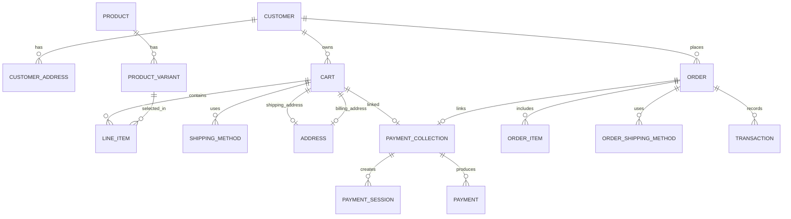

# Database & Data Mapping — Purchase Flow

عنوان: **گزارش ساختار پایگاه داده و نقشه‌برداری داده‌ها در فرآیند خرید**

این سند به‌صورت دقیق و بر اساس کدهای واقعی، مدل‌های دیتابیس DTO/Entity، روابط و عملیات خواندن/نوشتن در پروژه `depix-ecommerce` تنظیم شده است.

---

# بخش 1 — Database Architecture

در این بخش تمامی Entityها و مدل‌های دیتابیس درگیر در فرآیند خرید به همراه جزئیات کامل آن‌ها تحلیل شده‌اند:

---

### Entity 1: Product
- **Purpose:** نگهداری اطلاعات اصلی کالا (عنوان، اسلاگ، توضیحات، وضعیت انتشارات).
- **File:** `medusa/packages/modules/product/src/models/product.ts`
- **Module:** `@medusajs/product`
- **Important fields:** `id`, `title`, `handle`, `subtitle`, `description`, `status`, `thumbnail`, `metadata`, `created_at`, `updated_at`.
- **Relationships:** `variants` (hasMany ProductVariant), `options` (hasMany ProductOption), `categories` (manyToMany ProductCategory), `images` (manyToMany ProductImage).
- **Read operations:** لیست محصولات، صفحه محصول، بررسی آیتم‌های سبد خرید.
- **Write operations:** ایجاد و ویرایش محصول توسط پنل مدیریت (Admin API).

---

### Entity 2: Product Variant
- **Purpose:** نگهداری تنوع‌های یک محصول (رنگ، سایز، SKU، وزن، قیمت‌گذاری).
- **File:** `medusa/packages/modules/product/src/models/product-variant.ts`
- **Module:** `@medusajs/product`
- **Important fields:** `id`, `title`, `sku`, `barcode`, `ean`, `upc`, `allow_backorder`, `manage_inventory`, `hs_code`, `weight`, `length`, `height`, `width`, `product_id`.
- **Relationships:** `product` (belongsTo Product), `options` (manyToMany ProductOptionValue).
- **Read operations:** انتخاب تنوع توسط خریدار، افزودن به سبد خرید، صحه‌گذاری موجودی و قیمت.
- **Write operations:** تغییر اطلاعات تنوع در مدیریت یا بروزرسانی کد SKU.

---

### Entity 3: Price
- **Purpose:** نگهداری مبالغ و قیمت‌های محصولات بر اساس واحد پول و قوانین قیمت‌گذاری.
- **File:** `medusa/packages/modules/pricing/src/models/price.ts`
- **Module:** `@medusajs/pricing`
- **Important fields:** `id`, `amount`, `raw_amount`, `currency_code`, `min_quantity`, `max_quantity`, `price_set_id`, `rules_count`.
- **Relationships:** `price_set` (belongsTo PriceSet), `price_list` (belongsTo PriceList).
- **Read operations:** استعلام قیمت محصول بر اساس Currency/Region در لایه‌های Catalog و Cart.
- **Write operations:** ثبت و تغییر قیمت‌ها توسط پنل مدیریت.

---

### Entity 4: Inventory (InventoryItem / InventoryLevel / ReservationItem)
- **Purpose:** مدیریت تعداد موجودی، انبارها و رزرو موقت موجودی هنگام سفارش.
- **File:**
  - `medusa/packages/modules/inventory/src/models/inventory-item.ts`
  - `medusa/packages/modules/inventory/src/models/inventory-level.ts`
  - `medusa/packages/modules/inventory/src/models/reservation-item.ts`
- **Module:** `@medusajs/inventory`
- **Important fields:** `id`, `sku`, `stocked_quantity`, `reserved_quantity`, `location_id`, `inventory_item_id`, `line_item_id`, `quantity`.
- **Relationships:** `inventory_levels` (hasMany InventoryLevel), `reservation_items` (hasMany ReservationItem).
- **Read operations:** چک کردن موجودی قبل از افزودن به سبد خرید و قبل از ثبت سفارش.
- **Write operations:** ایجاد رزرو (`reservation_item`) در زمان `completeCartWorkflow` و کسر از `stocked_quantity`.

---

### Entity 5: Customer
- **Purpose:** نگهداری پروفایل خریداران ثبت‌نام‌شده.
- **File:** `medusa/packages/modules/customer/src/models/customer.ts`
- **Module:** `@medusajs/customer`
- **Important fields:** `id`, `email`, `first_name`, `last_name`, `phone`, `has_account`, `metadata`, `created_at`.
- **Relationships:** `addresses` (hasMany CustomerAddress), `groups` (manyToMany CustomerGroup).
- **Read operations:** فراخوانی اطلاعات حساب کاربر و تاریخچه سفارشات.
- **Write operations:** ثبت‌نام خریدار یا به روزرسانی پروفایل.

---

### Entity 6: Customer Address
- **Purpose:** دفترچه آدرس‌های ثبت‌شده در حساب کاربری خریدار.
- **File:** `medusa/packages/modules/customer/src/models/address.ts`
- **Module:** `@medusajs/customer`
- **Important fields:** `id`, `customer_id`, `company`, `first_name`, `last_name`, `address_1`, `address_2`, `city`, `country_code`, `province`, `postal_code`, `phone`, `is_default_shipping`, `is_default_billing`.
- **Relationships:** `customer` (belongsTo Customer).
- **Read operations:** دریافت آدرس‌های پیشنهادی حین تسویه حساب.
- **Write operations:** افزودن، ویرایش و حذف آدرس توسط کاربر.

---

### Entity 7: Cart
- **Purpose:** نگهداری وضعیت فعلی سبد خرید کاربر تا پیش از تبدیل به سفارش.
- **File:** `medusa/packages/modules/cart/src/models/cart.ts`
- **Module:** `@medusajs/cart`
- **Important fields:** `id`, `region_id`, `customer_id`, `sales_channel_id`, `email`, `currency_code`, `shipping_address_id`, `billing_address_id`, `completed_at`, `metadata`, `created_at`, `updated_at`.
- **Relationships:** `items` (hasMany LineItem), `shipping_methods` (hasMany ShippingMethod), `shipping_address` (hasOne Address), `billing_address` (hasOne Address).
- **Read operations:** تمام صفحات فرآیند خرید، محاسبه Totals، ایجاد PaymentCollection.
- **Write operations:** ساخت سبد خرید، اتصال ایمیل/آدرس، ست کردن `completed_at` پس از ثبت سفارش.

---

### Entity 8: Cart Item (LineItem)
- **Purpose:** قلم کالای موجود در سبد خرید.
- **File:** `medusa/packages/modules/cart/src/models/line-item.ts`
- **Module:** `@medusajs/cart`
- **Important fields:** `id`, `cart_id`, `title`, `subtitle`, `thumbnail`, `quantity`, `unit_price`, `raw_unit_price`, `variant_id`, `is_tax_inclusive`, `compare_at_unit_price`, `requires_shipping`, `is_discountable`.
- **Relationships:** `cart` (belongsTo Cart), `tax_lines` (hasMany LineItemTaxLine), `adjustments` (hasMany LineItemAdjustment).
- **Read operations:** نمایش سبد خرید، محاسبه قیمت‌ها و تبدیل به OrderItem.
- **Write operations:** افزودن، تغییر تعداد، حذف از سبد خرید.

---

### Entity 9: Shipping / Fulfillment
- **Purpose:** نگهداری رکوردهای مرسوله و پردازش انبار.
- **File:** `medusa/packages/modules/fulfillment/src/models/fulfillment.ts`
- **Module:** `@medusajs/fulfillment`
- **Important fields:** `id`, `location_id`, `packed_at`, `shipped_at`, `delivered_at`, `canceled_at`, `data`, `metadata`.
- **Relationships:** `items` (hasMany FulfillmentItem), `labels` (hasMany FulfillmentLabel).
- **Read operations:** پیگیری وضعیت ارسال مرسوله.
- **Write operations:** صدور حواله خروج و ثبت کد رهگیری مرسوله توسط مدیر.

---

### Entity 10: Shipping Method
- **Purpose:** روش ارسال انتخاب‌شده برای سبد خرید یا سفارش.
- **File:**
  - `medusa/packages/modules/cart/src/models/shipping-method.ts`
  - `medusa/packages/modules/order/src/models/order-shipping-method.ts`
- **Module:** `@medusajs/cart` و `@medusajs/order`
- **Important fields:** `id`, `cart_id`, `order_id`, `name`, `amount`, `raw_amount`, `is_tax_inclusive`, `shipping_option_id`, `data`.
- **Relationships:** `tax_lines` (hasMany ShippingMethodTaxLine), `adjustments` (hasMany ShippingMethodAdjustment).
- **Read operations:** محاسبه هزینه کل سبد خرید و ثبت روی فاکتور.
- **Write operations:** افزودن روش ارسال به سبد خرید هنگام تسویه حساب.

---

### Entity 11: Shipping Option
- **Purpose:** تعریف قوانین و روش‌های ارسال موجود در سیستم.
- **File:** `medusa/packages/modules/fulfillment/src/models/shipping-option.ts`
- **Module:** `@medusajs/fulfillment`
- **Important fields:** `id`, `name`, `price_type`, `service_zone_id`, `shipping_profile_id`, `provider_id`, `data`.
- **Relationships:** `rules` (hasMany ShippingOptionRule), `type` (belongsTo ShippingOptionType).
- **Read operations:** استعلام روش‌های ارسال معتبر برای آدرس خریدار.
- **Write operations:** تنظیم روش‌های ارسال در پنل مدیریت.

---

### Entity 12: Promotion / Discount
- **Purpose:** قوانین کد تخفیف و پروموشن‌های درصدی یا عددی.
- **File:**
  - `medusa/packages/modules/promotion/src/models/promotion.ts`
  - `medusa/packages/modules/promotion/src/models/application-method.ts`
- **Module:** `@medusajs/promotion`
- **Important fields:** `id`, `code`, `type`, `is_automatic`, `status`, `campaign_id`, `value`, `allocation`, `target_type`.
- **Relationships:** `application_method` (hasOne ApplicationMethod), `rules` (hasMany PromotionRule).
- **Read operations:** صحه‌گذاری کد تخفیف وارد شده توسط خریدار.
- **Write operations:** ایجاد کمپین تخفیفی در پنل مدیریت و ثبت میزان استفاده (`campaign_budget_usage`).

---

### Entity 13: Tax (TaxRate / LineItemTaxLine)
- **Purpose:** محاسبه مالیات بر ارزش افزوده روی کالاهام و ارسال.
- **File:**
  - `medusa/packages/modules/tax/src/models/tax-rate.ts`
  - `medusa/packages/modules/cart/src/models/line-item-tax-line.ts`
- **Module:** `@medusajs/tax` و `@medusajs/cart`
- **Important fields:** `id`, `rate`, `code`, `name`, `item_id`, `shipping_method_id`, `amount`, `raw_amount`.
- **Relationships:** `tax_region` (belongsTo TaxRegion).
- **Read operations:** محاسبه مجموع مالیات روی Cart.
- **Write operations:** ایجاد رکوردهای `tax_line` روی آیتم‌ها و ارسال.

---

### Entity 14: Order
- **Purpose:** سند قطعی و حقوقی خریدار پس از تکمیل فرآیند خرید.
- **File:** `medusa/packages/modules/order/src/models/order.ts`
- **Module:** `@medusajs/order`
- **Important fields:** `id`, `display_id`, `region_id`, `customer_id`, `version`, `status`, `email`, `currency_code`, `shipping_address_id`, `billing_address_id`, `no_notification`, `metadata`, `created_at`.
- **Relationships:** `items` (hasMany OrderItem), `shipping_methods` (hasMany OrderShippingMethod), `summary` (hasOne OrderSummary), `transactions` (hasMany Transaction).
- **Read operations:** مشاهده سفارش، پنل مدیریت، پیگیری سفارش، صدور فاکتور.
- **Write operations:** ثبت سفارش جدید در `completeCartWorkflow` یا تغییر وضعیت توسط مدیر.

---

### Entity 15: Order Item
- **Purpose:** اقلام ثبت‌شده در سفارش قطعی.
- **File:** `medusa/packages/modules/order/src/models/order-item.ts`
- **Module:** `@medusajs/order`
- **Important fields:** `id`, `order_id`, `item_id`, `quantity`, `fulfilled_quantity`, `shipped_quantity`, `return_requested_quantity`, `return_received_quantity`, `written_off_quantity`.
- **Relationships:** `order` (belongsTo Order), `item` (belongsTo LineItem).
- **Read operations:** جزئیات سفارش و صدور حواله خروج انبار.
- **Write operations:** ایجاد همزمان با ساخت Order.

---

### Entity 16: Payment Collection
- **Purpose:** مدیریت مجموعه پرداخت‌های مربوط به یک Cart یا Order.
- **File:** `medusa/packages/modules/payment/src/models/payment-collection.ts`
- **Module:** `@medusajs/payment`
- **Important fields:** `id`, `currency_code`, `amount`, `raw_amount`, `authorized_amount`, `captured_amount`, `refunded_amount`, `status`, `completed_at`.
- **Relationships:** `payment_sessions` (hasMany PaymentSession), `payments` (hasMany Payment).
- **Read operations:** برسی تسویه مالی قبل از ثبت سفارش.
- **Write operations:** ساخت کلکسیون پرداخت و بروزرسانی وضعیت مالی.

---

### Entity 17: Payment Session
- **Purpose:** نشست فعال پرداخت برای یک درگاه خاص (پرداخت در حال جریان).
- **File:** `medusa/packages/modules/payment/src/models/payment-session.ts`
- **Module:** `@medusajs/payment`
- **Important fields:** `id`, `payment_collection_id`, `provider_id`, `amount`, `raw_amount`, `currency_code`, `status`, `data`, `authorized_at`.
- **Relationships:** `payment_collection` (belongsTo PaymentCollection).
- **Read operations:** ارسال خریدار به درگاه پرداخت و پردازش کالبک.
- **Write operations:** ایجاد نشست، ذخیره داده‌های کالبک (`data`) و تغییر وضعیت به `authorized`.

---

### Entity 18: Payment
- **Purpose:** رکورد پرداخت مالی تأییدشده پس از Verification درگاه.
- **File:** `medusa/packages/modules/payment/src/models/payment.ts`
- **Module:** `@medusajs/payment`
- **Important fields:** `id`, `payment_collection_id`, `payment_session_id`, `provider_id`, `amount`, `raw_amount`, `currency_code`, `authorized_at`, `captured_at`, `data`.
- **Relationships:** `captures` (hasMany Capture), `refunds` (hasMany Refund).
- **Read operations:** صحت‌سنجی پرداخت نهایی سفارش.
- **Write operations:** ایجاد رکورد پس از Verification موفق درگاه.

---

### Entity 19: Payment Transaction
- **Purpose:** ردیابی تراکنش‌های مالی بدهکار/بستانکار ثبت‌شده روی سفارش.
- **File:** `medusa/packages/modules/order/src/models/transaction.ts`
- **Module:** `@medusajs/order`
- **Important fields:** `id`, `order_id`, `amount`, `raw_amount`, `currency_code`, `reference`, `reference_id`, `created_at`.
- **Relationships:** `order` (belongsTo Order).
- **Read operations:** محاسبه تراز مالی سفارش در `order_summary`.
- **Write operations:** ثبت تراکنش به محض موفقیت پرداخت در `completeCartWorkflow`.

---

### Entity 20: Auth / Session
- **Purpose:** مدیریت هویت کاربر و توکن‌های ورود به سیستم.
- **File:** `medusa/packages/modules/auth/src/models/auth-identity.ts`
- **Module:** `@medusajs/auth`
- **Important fields:** `id`, `provider`, `provider_metadata`, `user_metadata`, `app_metadata`.
- **Relationships:** `provider_identities` (hasMany ProviderIdentity).
- **Read operations:** احراز هویت درخواست‌های API.
- **Write operations:** ثبت یا به روزرسانی توکن‌ها و مشخصات ورود.

---

### Entity 21: OTP (One-Time Password)
- **Purpose:** کد تایید پیامکی جهت ورود سریع.
- **Status:** `STATUS: NOT_FOUND`
- **Evidence:**
> `در Repository فعلی شواهدی برای این مورد پیدا نشد.`

---

### Entity 22: Notification
- **Purpose:** ارسال ایونت‌ها و اعلانات سیستم.
- **File:** `medusa/packages/modules/notification/src/models/notification.ts`
- **Module:** `@medusajs/notification`
- **Important fields:** `id`, `to`, `channel`, `template`, `data`, `trigger_type`, `resource_id`, `resource_type`.
- **Relationships:** `provider` (belongsTo NotificationProvider).
- **Read operations:** مشاهده تاریخچه اعلانات ارسالی.
- **Write operations:** ثبت گزارش ارسال پیامک/ایمیل پس از ثبت سفارش.

---

# بخش 2 — Field Mapping

جدول نقشه‌برداری فیلدهای دیتابیس بر اساس کدهای واقعی موجود در پروژه:

| مرحله | Entity | Field | Read/Write | دلیل استفاده |
| :--- | :--- | :--- | :---: | :--- |
| Product Loading | Product | id, title, handle, thumbnail | READ | دریافت اطلاعات کالا جهت نمایش |
| Product Loading | ProductVariant | id, title, sku, product_id | READ | لیست تنوع‌های موجود محصول |
| Product Loading | Price | amount, currency_code | READ | نمایش قیمت واحد براساس Currency/Region |
| Add to Cart | Cart | id, currency_code, region_id | READ | برسی سبد خرید فعال جهت افزودن آیتم |
| Add to Cart | Cart Item (LineItem) | variant_id, quantity, unit_price | WRITE | اتصال محصول انتخاب‌شده به Cart |
| Cart Creation | Cart | region_id, sales_channel_id | WRITE | ساخت سبد جدید برای جلسه خرید |
| Customer Auth | AuthIdentity | provider, provider_metadata | READ/WRITE | احراز هویت توکن کاربری |
| Guest Checkout | Cart | email | WRITE | ثبت ایمیل خریدار مهمان رو سبد خرید |
| Customer Info | Cart | customer_id, email | WRITE | اتصال حساب کاربری ثبت‌شده به سبد خرید |
| Shipping Address | Cart Address | address_1, city, province, postal_code | WRITE | ذخیره آدرس تحویل گیرنده مرسوله |
| Billing Address | Cart Address | address_1, city, province, postal_code | WRITE | ذخیره آدرس صورتحساب خریدار |
| Shipping Method | Cart ShippingMethod | shipping_option_id, amount, name | WRITE | ثبت روش ارسال انتخاب شده روی سبد خرید |
| Shipping Rate | ShippingOption | price_type, service_zone_id, provider_id | READ | استعلام هزینه نرخ‌های ارسال معتبر |
| Promotion | LineItemAdjustment | amount, code, promotion_id | WRITE | ثبت تخفیف کسر شده روی آیتم‌ها |
| Tax | LineItemTaxLine | rate, name, amount | WRITE | ثبت خطوط مالیات محاسبه‌شده |
| Totals | Cart | subtotal, discount_total, total | READ | محاسبه مجموع مبالغ قابله پرداخت |
| Checkout Prep | PaymentCollection | amount, currency_code, status | WRITE | ساخت کلکسیون مالی معادل cart.total |
| Payment Session | PaymentSession | provider_id, amount, status, data | WRITE | ساخت نشست پرداخت آماده هدایت به درگاه |
| Order Creation | Order | display_id, status, email, currency_code | WRITE | ثبت نهایی سند سفارش در سیستم |
| Order Creation | OrderItem | quantity, item_id, order_id | WRITE | ثبت آیتم‌های خریده شده در سفارش |
| Order Creation | Cart | completed_at | WRITE | علامت‌گذاری سبد خرید به عنوان تکمیل‌شده |
| Verification | Payment | amount, authorized_at, provider_id | WRITE | ثبت رکورد قطعی پرداخت مالی |
| Payment Success | Transaction | amount, order_id, reference_id | WRITE | ثبت تراکنش بستانکاری روی سفارش |
| Payment Success | InventoryLevel | reserved_quantity, stocked_quantity | WRITE | کسر موجودی واقعی انبار |

---

# بخش 3 — Relationship Diagram

ارتباطات دیتابیسی (ER Diagram) استخراج شده از مدل‌های دیتابیس پروژه:



---

# بخش 4 — Data Flow Diagram

نمودار جریان داده‌های Purchase Flow و اتصال به Entityهای واقعی دیتابیس:

```text
  [ Product ] ──► [ ProductVariant ] ──► [ Price ]
                                             │
                                             ▼
                                     [ Cart LineItem ]
                                             │
                                             ▼
                                         [ Cart ] ◄── [ Customer / Address ]
                                             │
                                             ▼
                                   [ ShippingMethod ]
                                             │
                                             ▼
                                  [ PaymentCollection ]
                                             │
                                             ▼
                                   [ PaymentSession ]
                                             │
                                             ▼ (Verification Successful)
                                         [ Payment ]
                                             │
                                             ▼
                                         [ Order ] ──► [ Transaction ]
                                             │
                                             ▼
                                   [ ReservationItem ]
```

---

# بخش 5 — Read / Write Matrix

ماتریس کامل خواندن و نوشتن دیتابیس به همراه APIهای خارجی:

| مرحله | Database Read | Database Write | External API |
| :--- | :--- | :--- | :--- |
| Product Loading | `product`, `product_variant`, `price` | ندارد | ندارد |
| Cart Creation | `region`, `sales_channel` | `cart` | ندارد |
| Add Item | `cart`, `product_variant` | `line_item`, `line_item_tax_line` | ندارد |
| Address | `customer_address` | `address` | ندارد |
| Shipping | `shipping_option`, `geo_zone` | `shipping_method` | External Courier API (اختیاری) |
| Promotions | `promotion`, `campaign` | `line_item_adjustment` | ندارد |
| Checkout Prep | `cart` | `payment_collection` | ندارد |
| Payment Session | `payment_collection` | `payment_session` | Gateway Tokenize API |
| Verification | `payment_session` | `payment`, `payment_session` | Gateway Verify / Authorize API |
| Order Completion | `cart`, `payment` | `order`, `order_item`, `transaction` | SMS Gateway API (اعلان) |
| Inventory | `inventory_item` | `reservation_item`, `inventory_level` | ندارد |

---

# بخش 6 — Payment Data Boundary

مرز داده‌های مالی (چه داده‌ای در دیتابیس ما می‌ماند و چه داده‌ای مبادله می‌شود):

```text
                  [ Database پروژه ]
             (cart_id, amount, currency)
                          │
                          │ 1. Payment Request (Amount, CallbackURL)
                          ▼
             [ Payment Provider / Gateway ]
                          │
                          │ 2. Redirect / Response (Authority, Token)
                          ▼
                  [ Database پروژه ]
             (ذخیره Token در payment_session.data)
                          │
                          │ 3. Verification Call (Authority, Amount)
                          ▼
             [ Payment Provider / Gateway ]
                          │
                          │ 4. Verification Result (RefID, Status=100)
                          ▼
                  [ Database پروژه ]
          (ایجاد Payment & Transaction با RefID)
```

### داده‌های ذخیره شده در دیتابیس ما:
- `amount` (مبلغ کل)
- `currency_code` (واحد پول)
- `provider_id` (شناسه درگاه)
- `status` (وضعیت پرداخت)
- `payment_session.data` (حاوی `Authority` یا `Token` صادر شده توسط درگاه)
- `payment.data` (حاوی `RefID` یا شماره پیگیری نهایی)

### داده‌های ارسالی به درگاه:
- `amount` (مبلغ به ریال/تومان)
- `callback_url` (آدرس بازگشت)
- `description` (شماره سبد خرید)
- `email` / `mobile` (اطلاعات تماس خریدار)

### داده‌های برگشتی از درگاه:
- `Status` / `Code` (کد وضعیت پرداخت)
- `Authority` / `TrackId` (کد پیگیری اولیه)
- `RefID` / `CardPan` (شماره مرجع نهایی و شماره کارت ماسک‌شده)

---

# بخش 7 — Security Boundary

اصول امنیتی مرز داده‌ها در پروژه:

1. **عدم ذخیره‌سازی اطلاعات حساس کارت:** اطلاعات شماره کارت كامل، CVV2 و رمز دوم به‌هیچ‌وجه در دیتابیس ذخیره نمیشوند و کلیه این اطلاعات در صفحات امن درگاه بانک (Shaparak) پردازش می‌گردند.
2. **عدم اعتماد به Return URL:** داده‌های دریافتی از طریق Query Parameterهای Return URL کاملاً نامعتبر تلقی شده و حتماً باید از طریق فراخوانی مستقیم API استعلام (Verification) توسط بک‌اند تایید شوند.
3. **عدم امکان دستکاری مبلغ (Price Tampering):** مبلغ ارسالی به درگاه و مبلغ استعلام‌شده مستقیماً از رکورد `payment_session.amount` دیتابیس خوانده می‌شود و از دریافت مبلغ از سمت فرانت‌اند جلوگیری به عمل می‌آید.

---

# بخش 8 — Unknown / Missing Data

جدول خلاصه موارد بررسی‌شده در مخزن پروژه که پیاده‌سازی Custom ندارند یا نیازمند تکمیل می‌باشند:

| مورد | وضعیت | Evidence / Path | اهمیت |
| :--- | :---: | :--- | :---: |
| Storefront UI (PDP/Cart/Checkout) | `NOT_FOUND` | فرانت‌اند در مخزن موجود نیست | **High** |
| Iranian Payment Provider (زرین‌پال/سداد) | `NOT_FOUND` | `medusa/packages/modules/providers` (فقط Stripe و Manual موجود است) | **Critical** |
| Iranian SMS Gateway (کاوه‌نگار) | `NOT_FOUND` | `medusa/packages/modules/providers` | **High** |
| OTP Authentication | `NOT_FOUND` | `medusa/packages/modules/auth/src/models` | **Medium** |
| Dynamic Shipping Courier API | `NOT_FOUND` | `medusa/packages/modules/fulfillment` | **Medium** |

---

# بخش 9 — Final Architecture

تصویر نهایی معماری داده و ساختار اجرای فرآیند خرید در پروژه `depix-ecommerce`:

```text
                    STOREFRONT / CLIENT
                             │
                             ▼
                    PRODUCT CATALOG
                             │
                             ▼
                       CART SYSTEM
                   /        │        \
                  /         │         \
                 v          v          v
          CUSTOMER       ADDRESS     SHIPPING
          ACCOUNT        DETAILS      OPTION
                  \         │         /
                   \        │        /
                    v       v       v
                     TOTALS & TAX
                            │
                            ▼
                    PAYMENT COLLECTION
                            │
                            ▼
                     PAYMENT SESSION
                            │
                            ▼
                   PAYMENT PROVIDER (Gateway)
                            │
                            ▼
                   VERIFICATION / AUTHORIZE
                            │
                            ▼
                   ORDER & TRANSACTION
```
