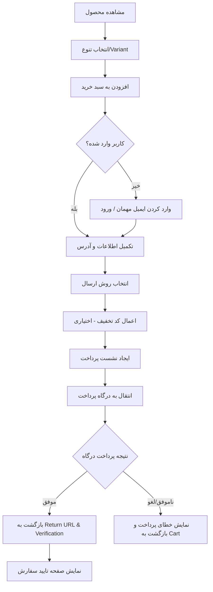
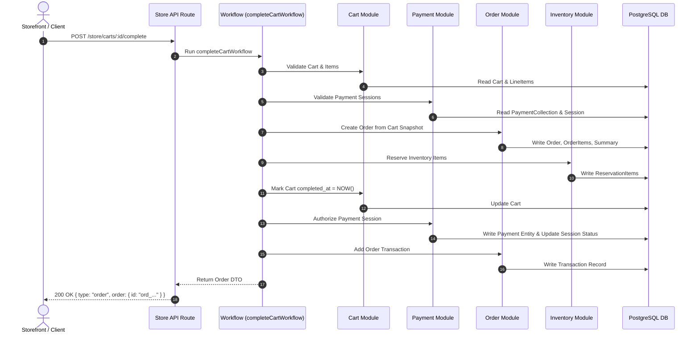

# گزارش کامل جریان خرید فروشگاه تا لحظه پرداخت

این گزارش به‌صورت اختصاصی و بر اساس **ساختار واقعی پروژه فعلی** (`depix-ecommerce`) استخراج شده است. در این بررسی، تمام کدهای موجود در مخزن، ماژول‌های فعال، مسیرهای API، ورک‌فلوها (Workflows)، مدل‌های پایگاه داده و زیرساخت ارتباطی بررسی شده‌اند.

---

# بخش 1 — نمای کلی Architecture

بر اساس تحلیل دقیق مخزن پروژه، معماری واقعی سیستم از لایه Nginx تا پایگاه داده و پردازش سفارشات به شرح زیر است:

```text
               [ کاربر / مرورگر ]
                       │
                       ▼
              ┌─────────────────┐
              │   Nginx Proxy   │ (infrastructure/nginx/nginx.conf)
              └────────┬────────┘
                       │
         ┌─────────────┴─────────────┐
         │                           │
         ▼                           ▼
┌──────────────────┐       ┌──────────────────┐
│  Payload CMS     │       │  Medusa Backend  │ (port 9000)
│  (Content/Admin) │       │  (E-Commerce Engine)
└────────┬─────────┘       └─────────┬────────┘
         │                           │
         └─────────────┬─────────────┘
                       │
            ┌──────────┴──────────┐
            ▼                     ▼
     ┌──────────────┐      ┌──────────────┐
     │  PostgreSQL  │      │    Redis     │
     │  (Shared DB) │      │  (Cache/Bus) │
     └──────────────┘      └──────────────┘
```

### ساختار واقعی جریان داده خرید در سیستم:

```text
Product API (/store/products)
    ↓
Product Variant (/store/product-variants)
    ↓
Cart Creation (/store/carts)
    ↓
Cart Item Creation (/store/carts/:id/line-items)
    ↓
Customer / Guest Email Assignment (/store/carts/:id)
    ↓
Shipping Address & Billing Address (/store/carts/:id)
    ↓
Shipping Options & Rate Calculation (/store/shipping-options)
    ↓
Shipping Method Selection (/store/carts/:id/shipping-methods)
    ↓
Promotions & Adjustments (/store/carts/:id/promotions)
    ↓
Cart Totals Calculation (Subtotal, Tax, Discount, Total)
    ↓
Payment Collection Creation (/store/payment-collections)
    ↓
Payment Session Creation (/store/payment-collections/:id/payment-sessions)
    ↓
Cart Completion Workflow (completeCartWorkflow)
    ↓
Payment Authorization & Verification
    ↓
Order Creation & Inventory Reservation
    ↓
Final Order & Transaction State
```

---

# بخش 2 — جریان خرید مرحله به مرحله

در این بخش، کلیه ۲۷ مرحله الزامی فرآیند خرید بر اساس کدهای واقعی موجود در پروژه تحلیل شده‌اند:

---

## مرحله 1 — Product Loading

### Trigger
ورود کاربر به صفحه محصول یا لیست محصولات.

### Frontend
`STATUS: NOT_FOUND`
> `در Repository فعلی شواهدی برای این مورد پیدا نشد.` (برنامه فرانت‌اند Storefront در مخزن پروژه پیاده‌سازی نشده است).

### API
```text
GET /store/products
GET /store/products/:id
```

### Backend
- **Module:** `@medusajs/product`
- **Route Handler:** `medusa/packages/medusa/src/api/store/products/route.ts` و `[id]/route.ts`
- **Workflow:** `getProductsListWorkflow` (`medusa/packages/core/core-flows/src/product/workflows/get-products-list.ts`)

### Database
- **Read:** `product`, `product_variant`, `product_option`, `product_image`, `price` (از طریق Remote Link به ماژول Pricing).
- **Create/Update:** ندارد.

### خروجی
لیست یا شیء DTO محصول همراه با قیمت‌های محاسبه‌شده بر اساس کانال فروش و منطقه (Region).

### Evidence
- `medusa/packages/medusa/src/api/store/products/route.ts`
- `medusa/packages/modules/product/src/models/product.ts`

---

## مرحله 2 — Variant Selection

### Trigger
انتخاب ویژگی‌های محصول (مانند رنگ، سایز) توسط کاربر.

### Frontend
`STATUS: NOT_FOUND`
> `در Repository فعلی شواهدی برای این مورد پیدا نشد.`

### API
```text
GET /store/products/:id
GET /store/product-variants/:id
```

### Backend
- **Module:** `@medusajs/product`
- **Route Handler:** `medusa/packages/medusa/src/api/store/product-variants/route.ts`

### Database
- **Read:** `product_variant`, `product_option_value`, `price`
- **Create/Update:** ندارد.

### خروجی
شیء `ProductVariant` شامل `variant_id` و اطلاعات موجودی و قیمت واحد.

### Evidence
- `medusa/packages/medusa/src/api/store/product-variants/route.ts`
- `medusa/packages/modules/product/src/models/product-variant.ts`

---

## مرحله 3 — Add to Cart

### Trigger
کلیک کاربر روی دکمه «افزودن به سبد خرید».

### Frontend
`STATUS: NOT_FOUND`
> `در Repository فعلی شواهدی برای این مورد پیدا نشد.`

### API
```text
POST /store/carts/:id/line-items
```

### Backend
- **Module:** `@medusajs/cart`
- **Route Handler:** `medusa/packages/medusa/src/api/store/carts/[id]/line-items/route.ts`
- **Workflow:** `addToCartWorkflow` (`medusa/packages/core/core-flows/src/cart/workflows/add-to-cart.ts`)

### Database
- **Read:** `cart`, `product_variant`, `price_set`
- **Create:** `line_item`, `line_item_tax_line`, `line_item_adjustment`

### خروجی
شیء Cart به روز شده شامل آیتم جدید اضافه شده و مجموع قیمت‌های باز محاسبه‌شده.

### Evidence
- `medusa/packages/medusa/src/api/store/carts/[id]/line-items/route.ts`
- `medusa/packages/core/core-flows/src/cart/workflows/add-to-cart.ts`

---

## مرحله 4 — Cart Creation

### Trigger
ایجاد اولین سبد خرید هنگام ورود به فرآیند خرید یا افزودن اولین محصول.

### Frontend
`STATUS: NOT_FOUND`
> `در Repository فعلی شواهدی برای این مورد پیدا نشد.`

### API
```text
POST /store/carts
```

### Backend
- **Module:** `@medusajs/cart`
- **Route Handler:** `medusa/packages/medusa/src/api/store/carts/route.ts`
- **Workflow:** `createCartWorkflow` (`medusa/packages/core/core-flows/src/cart/workflows/create-carts.ts`)

### Database
- **Read:** `region`, `sales_channel`
- **Create:** `cart`

### خروجی
کارت جدید با شناسه یکتا (UUID)، `currency_code` و مشخصات منطقه خریدار.

### Evidence
- `medusa/packages/medusa/src/api/store/carts/route.ts`
- `medusa/packages/core/core-flows/src/cart/workflows/create-carts.ts`

---

## مرحله 5 — Cart Item Creation

### Trigger
مرحله داخلی اجرا شده توسط `addToCartWorkflow`.

### Frontend
`STATUS: NOT_FOUND`
> `در Repository فعلی شواهدی برای این مورد پیدا نشد.`

### API
```text
POST /store/carts/:id/line-items
```

### Backend
- **Module:** `@medusajs/cart`
- **Step:** `createLineItemsStep` (`medusa/packages/core/core-flows/src/cart/steps/create-line-items.ts`)

### Database
- **Create:** رکورد `line_item` متصل به `cart_id` با فیلدهای `variant_id`, `quantity`, `unit_price`.

### خروجی
ایجاد رکورد دیتابیسی `line_item` و اتصال به Cart.

### Evidence
- `medusa/packages/core/core-flows/src/cart/steps/create-line-items.ts`
- `medusa/packages/modules/cart/src/models/line-item.ts`

---

## مرحله 6 — Cart Update

### Trigger
تغییر تعداد محصول، تغییر ایمیل یا به روزرسانی مشخصات سبد خرید.

### Frontend
`STATUS: NOT_FOUND`
> `در Repository فعلی شواهدی برای این مورد پیدا نشد.`

### API
```text
POST /store/carts/:id
POST /store/carts/:id/line-items/:line_id
DELETE /store/carts/:id/line-items/:line_id
```

### Backend
- **Module:** `@medusajs/cart`
- **Workflow:** `updateCartWorkflow` و `updateLineItemInCartWorkflow`

### Database
- **Read:** `cart`, `line_item`
- **Update:** `line_item` (تعداد) یا `cart` (اطلاعات کلی)

### خروجی
شیء Cart به روز رسانی شده.

### Evidence
- `medusa/packages/medusa/src/api/store/carts/[id]/line-items/[line_id]/route.ts`
- `medusa/packages/core/core-flows/src/cart/workflows/update-line-item-in-cart.ts`

---

## مرحله 7 — Customer Authentication

### Trigger
ورود یا ثبت‌نام کاربر در سیستم.

### Frontend
`STATUS: NOT_FOUND`
> `در Repository فعلی شواهدی برای این مورد پیدا نشد.`

### API
```text
POST /auth/user/emailpass
POST /auth/customer/emailpass
```

### Backend
- **Module:** `@medusajs/auth` & `@medusajs/customer`
- **Route Handler:** `medusa/packages/medusa/src/api/auth/route.ts`

### Database
- **Read:** `auth_identity`, `customer`
- **Update:** `auth_identity` (نشست و توکن JWT)

### خروجی
توکن احراز هویت JWT و شیء کاربری Customer.

### Evidence
- `medusa/packages/modules/auth/src/models/auth-identity.ts`
- `medusa/packages/modules/customer/src/models/customer.ts`

---

## مرحله 8 — Guest Checkout

### Trigger
اقدام به خرید کاربر بدون ورود به حساب کاربری با ارائه ایمیل در Cart.

### Frontend
`STATUS: NOT_FOUND`
> `در Repository فعلی شواهدی برای این مورد پیدا نشد.`

### API
```text
POST /store/carts
POST /store/carts/:id
```

### Backend
- **Module:** `@medusajs/cart`
- **Route Handler:** `medusa/packages/medusa/src/api/store/carts/[id]/route.ts`

### Database
- **Read:** `cart`
- **Update:** `cart.email` (مقدار `customer_id` خالی یا null می‌ماند).

### خروجی
سبد خرید تنظیم شده با ایمیل خریدار مهمان بدون نیاز به Customer ID.

### Evidence
- `medusa/packages/modules/cart/src/models/cart.ts` (فیلدهای `email` و `customer_id` به‌صورت اختیاری/nullable تعریف شده‌اند).

---

## مرحله 9 — Customer Information

### Trigger
ثبت ایمیل/تلفن تماس در تسویه حساب یا اتصال حساب کاربری به سبد خرید.

### Frontend
`STATUS: NOT_FOUND`
> `در Repository فعلی شواهدی برای این مورد پیدا نشد.`

### API
```text
POST /store/carts/:id
```

### Backend
- **Module:** `@medusajs/cart` & `@medusajs/customer`
- **Workflow:** `transferCartCustomerWorkflow` (`medusa/packages/core/core-flows/src/cart/workflows/transfer-cart-customer.ts`)

### Database
- **Read:** `customer`, `cart`
- **Update:** `cart.email`, `cart.customer_id`

### خروجی
اتصال سبد خرید به Customer ID و ایمیل مربوطه.

### Evidence
- `medusa/packages/core/core-flows/src/cart/workflows/transfer-cart-customer.ts`

---

## مرحله 10 — Shipping Address

### Trigger
وارد کردن یا انتخاب آدرس ارسال توسط خریدار.

### Frontend
`STATUS: NOT_FOUND`
> `در Repository فعلی شواهدی برای این مورد پیدا نشد.`

### API
```text
POST /store/carts/:id
```

### Backend
- **Module:** `@medusajs/cart`
- **Workflow:** `updateCartWorkflow` (`medusa/packages/core/core-flows/src/cart/workflows/update-cart.ts`)

### Database
- **Create/Update:** رکورد `address` متصل به `cart.shipping_address_id`.

### خروجی
سبد خرید حاوی آدرس گیرنده (Shipping Address).

### Evidence
- `medusa/packages/modules/cart/src/models/address.ts`
- `medusa/packages/core/core-flows/src/cart/workflows/update-cart.ts`

---

## مرحله 11 — Billing Address

### Trigger
وارد کردن آدرس صورتحساب یا انتخاب گزینه «مشابه آدرس ارسال».

### Frontend
`STATUS: NOT_FOUND`
> `در Repository فعلی شواهدی برای این مورد پیدا نشد.`

### API
```text
POST /store/carts/:id
```

### Backend
- **Module:** `@medusajs/cart`
- **Workflow:** `updateCartWorkflow`

### Database
- **Create/Update:** رکورد `address` متصل به `cart.billing_address_id`.

### خروجی
سبد خرید حاوی آدرس صورتحساب (Billing Address).

### Evidence
- `medusa/packages/modules/cart/src/models/address.ts`

---

## مرحله 12 — Shipping Method

### Trigger
انتخاب روش ارسال از میان گزینه‌های موجود توسط کاربر.

### Frontend
`STATUS: NOT_FOUND`
> `در Repository فعلی شواهدی برای این مورد پیدا نشد.`

### API
```text
POST /store/carts/:id/shipping-methods
```

### Backend
- **Module:** `@medusajs/cart` & `@medusajs/fulfillment`
- **Route Handler:** `medusa/packages/medusa/src/api/store/carts/[id]/shipping-methods/route.ts`
- **Workflow:** `addShippingMethodToCartWorkflow` (`medusa/packages/core/core-flows/src/cart/workflows/add-shipping-method-to-cart.ts`)

### Database
- **Read:** `shipping_option`
- **Create:** رکورد `shipping_method` متصل به `cart_id`.

### خروجی
روش ارسال ثبت شده روی Cart و محاسبه هزینه ارسال روی Total.

### Evidence
- `medusa/packages/medusa/src/api/store/carts/[id]/shipping-methods/route.ts`
- `medusa/packages/core/core-flows/src/cart/workflows/add-shipping-method-to-cart.ts`

---

## مرحله 13 — Shipping Rate

### Trigger
دریافت لیست گزینه‌های ارسال ممکن برای آدرس و منطقه سبد خرید.

### Frontend
`STATUS: NOT_FOUND`
> `در Repository فعلی شواهدی برای این مورد پیدا نشد.`

### API
```text
GET /store/shipping-options?cart_id=:id
```

### Backend
- **Module:** `@medusajs/fulfillment`
- **Workflow:** `listShippingOptionsForCartWorkflow` (`medusa/packages/core/core-flows/src/cart/workflows/list-shipping-options-for-cart.ts`)

### Database
- **Read:** `shipping_option`, `shipping_option_rule`, `geo_zone`, `price_set`
- **Create/Update:** ندارد.

### خروجی
لیستی از گزینه‌های ارسال معتبر به همراه مبلغ محاسبه‌شده.

### Evidence
- `medusa/packages/core/core-flows/src/cart/workflows/list-shipping-options-for-cart.ts`

---

## مرحله 14 — Promotion

### Trigger
وارد کردن کد تخفیف توسط کاربر یا اعمال خودکار کمپین.

### Frontend
`STATUS: NOT_FOUND`
> `در Repository فعلی شواهدی برای این مورد پیدا نشد.`

### API
```text
POST /store/carts/:id/promotions
```

### Backend
- **Module:** `@medusajs/promotion` & `@medusajs/cart`
- **Workflow:** `updateCartPromotionsWorkflow` (`medusa/packages/core/core-flows/src/cart/workflows/update-cart-promotions.ts`)

### Database
- **Read:** `promotion`, `application_method`, `campaign`
- **Create:** `line_item_adjustment` یا `shipping_method_adjustment`

### خروجی
لینک شدن تخفیف روی آیتم‌های سبد خرید یا هزینه ارسال.

### Evidence
- `medusa/packages/core/core-flows/src/cart/workflows/update-cart-promotions.ts`

---

## مرحله 15 — Discount

### Trigger
محاسبه مقدار تخفیف عددی یا درصدی روی سبد خرید.

### Frontend
`STATUS: NOT_FOUND`
> `در Repository فعلی شواهدی برای این مورد پیدا نشد.`

### API
```text
POST /store/carts/:id/promotions
```

### Backend
- **Module:** `@medusajs/promotion` & `@medusajs/cart`

### Database
- **Create/Update:** `line_item_adjustment` (حاوی مقادیر `amount`, `code`, `promotion_id`).

### خروجی
کسر مبلغ تخفیف از subtotal و به روزرسانی discount_total.

### Evidence
- `medusa/packages/modules/cart/src/models/line-item-adjustment.ts`

---

## مرحله 16 — Tax

### Trigger
محاسبه مالیات بر اساس آدرس تحویل و نرخ‌های منطقه مالیاتی (Tax Region).

### Frontend
`STATUS: NOT_FOUND`
> `در Repository فعلی شواهدی برای این مورد پیدا نشد.`

### API
محاسبه خودکار هنگام به روزرسانی آدرس یا آیتم‌ها.

### Backend
- **Module:** `@medusajs/tax` & `@medusajs/cart`
- **Workflow:** `updateTaxLinesWorkflow` (`medusa/packages/core/core-flows/src/cart/workflows/update-tax-lines.ts`)

### Database
- **Read:** `tax_rate`, `tax_region`
- **Create:** `line_item_tax_line` و `shipping_method_tax_line`

### خروجی
ثبت خطوط مالیاتی تفکیک‌شده و اضافه شدن tax_total به مبلغ نهایی.

### Evidence
- `medusa/packages/core/core-flows/src/cart/workflows/update-tax-lines.ts`
- `medusa/packages/modules/cart/src/models/line-item-tax-line.ts`

---

## مرحله 17 — Cart Totals

### Trigger
هرگونه تغییر در آیتم‌ها، روش ارسال، تخفیف یا مالیات.

### Frontend
`STATUS: NOT_FOUND`
> `در Repository فعلی شواهدی برای این مورد پیدا نشد.`

### API
محاسبه روی کلیه پاسخ‌های Cart API.

### Backend
- **Module:** `@medusajs/cart` (موتور محاسباتی Totals)

### Database
- **Read:** `line_item`, `shipping_method`, `line_item_adjustment`, `line_item_tax_line`

### خروجی
محاسبه فیلدهای مجازی: `subtotal`, `discount_total`, `shipping_total`, `tax_total`, `total`.

### Evidence
- `medusa/packages/modules/cart/src/models/cart.ts`

---

## مرحله 18 — Checkout Preparation

### Trigger
آماده‌سازی برای پرداخت و ایجاد Payment Collection برای سبد خرید.

### Frontend
`STATUS: NOT_FOUND`
> `در Repository فعلی شواهدی برای این مورد پیدا نشد.`

### API
```text
POST /store/payment-collections
```

### Backend
- **Module:** `@medusajs/payment`
- **Workflow:** `createPaymentCollectionForCartWorkflow` (`medusa/packages/core/core-flows/src/cart/workflows/create-payment-collection-for-cart.ts`)

### Database
- **Read:** `cart` (مبالغ نهایی)
- **Create:** `payment_collection` متصل به Cart از طریق Remote Link (`cart_payment_collection`).

### خروجی
ایجاد `payment_collection` فعال با وضعیت `pending` و مبلغ برابر با `cart.total`.

### Evidence
- `medusa/packages/core/core-flows/src/cart/workflows/create-payment-collection-for-cart.ts`
- `medusa/packages/modules/payment/src/models/payment-collection.ts`

---

## مرحله 19 — Order Creation

### Trigger
تأیید نهایی و اجرای `completeCartWorkflow`.

### Frontend
`STATUS: NOT_FOUND`
> `در Repository فعلی شواهدی برای این مورد پیدا نشد.`

### API
```text
POST /store/carts/:id/complete
```

### Backend
- **Module:** `@medusajs/order`
- **Route Handler:** `medusa/packages/medusa/src/api/store/carts/[id]/complete/route.ts`
- **Workflow:** `completeCartWorkflow` (`medusa/packages/core/core-flows/src/cart/workflows/complete-cart.ts`)

### Database
- **Read:** `cart`
- **Create:** `order`, `order_item`, `order_shipping_method`, `order_summary`, `order_change`, رکوردهای Remote Link (`order_cart`, `order_payment`, `order_promotion`)
- **Update:** `cart.completed_at` (با زمان فعلی)

### خروجی
ایجاد رکورد سفارش (`order`) با وضعیت `pending` و کد نمایش `display_id`.

### Evidence
- `medusa/packages/core/core-flows/src/cart/workflows/complete-cart.ts`
- `medusa/packages/modules/order/src/models/order.ts`

---

## مرحله 20 — Payment Session

### Trigger
ایجاد نشست پرداخت برای تامین‌کننده (Provider) انتخابی.

### Frontend
`STATUS: NOT_FOUND`
> `در Repository فعلی شواهدی برای این مورد پیدا نشد.`

### API
```text
POST /store/payment-collections/:id/payment-sessions
```

### Backend
- **Module:** `@medusajs/payment`
- **Workflow:** `createPaymentSessionsWorkflow` (`medusa/packages/core/core-flows/src/payment-collection/workflows/create-payment-session.ts`)

### Database
- **Read:** `payment_collection`
- **Create:** `payment_session` با فیلدهای `provider_id`, `amount`, `currency_code`, `status: pending`, `data`.

### خروجی
نشست پرداخت فعال (`payment_session`) متصل به PaymentCollection.

### Evidence
- `medusa/packages/core/core-flows/src/payment-collection/workflows/create-payment-session.ts`
- `medusa/packages/modules/payment/src/models/payment-session.ts`

---

## مرحله 21 — Payment Provider

### Trigger
فراخوانی افزونه درگاه پرداخت (مانند `pp_system_default` یا `pp_stripe_stripe`).

### Frontend
`STATUS: NOT_FOUND`
> `در Repository فعلی شواهدی برای این مورد پیدا نشد.`

### API
اینترفیس داخلی Provider در ماژول `@medusajs/payment`.

### Backend
- **Module:** `@medusajs/payment` و Provider Plugins (مانند `payment-stripe`)

### Database
- **Read/Write:** فیلد `payment_session.data` (ذخیره توکن، کلید و شناسه درگاه خارجی).

### خروجی
داده‌های لازم برای هدایت به درگاه یا Client Secret درگاه.

### Evidence
- `medusa/packages/modules/payment/src/models/payment-provider.ts`
- `medusa/packages/modules/providers/payment-stripe`

---

## مرحله 22 — Redirect to Payment

### Trigger
دریافت لینک انتقال به درگاه توسط فرانت‌اند و هدایت مرورگر کاربر.

### Frontend
`STATUS: NOT_FOUND`
> `در Repository فعلی شواهدی برای این مورد پیدا نشد.`

### API
انتقال مرورگر به لینک خارجی درگاه پرداخت (Gateway URL).

### Backend
پروژه فعلی فاقد Provider اختصاصی درگاه‌های ایرانی (مانند زرین‌پال یا سداد) در سورس‌کد است.

### Database
بدون تغییر در دیتابیس در لحظه هدایت.

### خروجی
خروج کاربر از وب‌سایت و هدایت به صفحه پرداخت درگاه.

### Evidence
> `در Repository فعلی شواهدی برای این مورد پیدا نشد.`

---

## مرحله 23 — Payment Callback

### Trigger
بازگشت کاربر از درگاه به Return URL یا دریافت Webhook هوک از درگاه.

### Frontend
`STATUS: NOT_FOUND`
> `در Repository فعلی شواهدی برای این مورد پیدا نشد.`

### API
```text
POST /store/payment-collections/:id/payment-sessions/:session_id/authorize
```
یا وب‌هوک درگاه:
```text
POST /hooks/payment/:provider_id
```

### Backend
- **Module:** `@medusajs/payment`
- **Step:** `authorizePaymentSessionStep` (`medusa/packages/core/core-flows/src/payment/steps/authorize-payment-session.ts`)

### Database
- **Read:** `payment_session`, `payment_collection`
- **Update:** `payment_session.status`

### خروجی
دریافت پارامترهای بازگشتی درگاه (مانند `Authority`, `RefID`, `Status`).

### Evidence
- `medusa/packages/medusa/src/api/store/payment-collections/route.ts`
- `medusa/packages/core/core-flows/src/payment/steps/authorize-payment-session.ts`

---

## مرحله 24 — Payment Verification

### Trigger
استعلام صحت پرداخت از API درگاه توسط بک‌اند (Verification / Authorize).

### Frontend
`STATUS: NOT_FOUND`
> `در Repository فعلی شواهدی برای این مورد پیدا نشد.`

### API
فراخوانی API درگاه توسط بک‌اند (مثلاً `paymentProvider.authorizePayment`).

### Backend
- **Module:** `@medusajs/payment`
- **Step:** `authorizePaymentSessionStep`

### Database
- **Create:** رکورد `payment` (با فیلدهای `amount`, `authorized_at`, `raw_amount`).
- **Create:** رکورد `capture` (در صورت پرداخت آنی).
- **Update:** وضعیت `payment_session.status` به `authorized`.

### خروجی
تأیید نهایی تراکنش و ثبت شیء `payment` معتبر در سیستم.

### Evidence
- `medusa/packages/core/core-flows/src/payment/steps/authorize-payment-session.ts`
- `medusa/packages/modules/payment/src/models/payment.ts`

---

## مرحله 25 — Payment Success

### Trigger
موفقیت‌آمیز بودن Verification و تکمیل فرآیند ثبت سفارش در `completeCartWorkflow`.

### Frontend
`STATUS: NOT_FOUND`
> `در Repository فعلی شواهدی برای این مورد پیدا نشد.`

### API
پاسخ API به صورت `{ type: "order", order: { id: "ord_..." } }`.

### Backend
اجرای `addOrderTransactionStep` در `completeCartWorkflow` و رزرو موجودی و ارسال ایونت `order.placed`.

### Database
- **Create:** رکورد `transaction` (تراکنش مالی متصل به سفارش).
- **Update:** `order.status = "pending"`, کسر موجودی از `inventory_level`.

### خروجی
سفارش تکمیل‌شده با تراکنش ثبت‌شده.

### Evidence
- `medusa/packages/core/core-flows/src/cart/workflows/complete-cart.ts`
- `medusa/packages/modules/order/src/models/transaction.ts`

---

## مرحله 26 — Payment Failure

### Trigger
خطای پرداخت در درگاه، انصراف کاربر، عدم تطابق مبلغ یا ناموفق بودن Verification.

### Frontend
`STATUS: NOT_FOUND`
> `در Repository فعلی شواهدی برای این مورد پیدا نشد.`

### API
پاسخ API به صورت `{ type: "cart", error: { message: "..." } }`.

### Backend
اجرای `compensatePaymentIfNeededStep` در `completeCartWorkflow` برای جبران و رول‌بک (Compensation).

### Database
- **Update:** `payment_session.status = "error"` یا `"canceled"`.
- **Update:** مقدار `cart.completed_at` خالی می‌ماند و سفارش لغو می‌شود.

### خروجی
بازگشت سبد خرید به حالت باز جهت تلاش مجدد خریدار بدون ثبت سفارش نامعتبر.

### Evidence
- `medusa/packages/core/core-flows/src/cart/steps/compensate-payment-if-needed.ts`
- `medusa/packages/core/core-flows/src/cart/workflows/complete-cart.ts`

---

## مرحله 27 — Order State After Payment

### Trigger
وضعیت نهایی سیستم پس از پرداخت موفق و ثبت سفارش.

### Frontend
`STATUS: NOT_FOUND`
> `در Repository فعلی شواهدی برای این مورد پیدا نشد.`

### API
```text
GET /store/orders/:id
```

### Backend
- **Module:** `@medusajs/order`

### Database
- `order.status` = `"pending"`
- `order.fulfillment_status` = `"not_fulfilled"`
- `order.payment_status` = `"authorized"` (یا `"captured"`)
- `cart.completed_at` = زمان تکمیل خرید

### خروجی
شیء سفارش غیرقابل تغییر (Immutable Order) آماده پردازش و ارسال توسط مدیر.

### Evidence
- `medusa/packages/modules/order/src/models/order.ts`
- `medusa/packages/core/core-flows/src/cart/workflows/complete-cart.ts`

---

# بخش 3 — Customer Flow

جریان مدیریت کاربران و احراز هویت در پروژه به شرح زیر است:

```text
               [ کاربر / خریدار ]
                       │
         ┌─────────────┴─────────────┐
         ▼                           ▼
  [ خریدار مهمان ]             [ کاربر ثبت‌نامی ]
         │                           │
         ▼                           ▼
  ثبت ایمیل در Cart          احراز هویت JWT (/auth/customer/emailpass)
  (customer_id = null)               │
         │                           ▼
         │                 اتصال به Cart (customer_id = cus_...)
         │                           │
         └─────────────┬─────────────┘
                       │
                       ▼
             [ ادامه فرآیند Checkout ]
```

### تحلیل فنی:
1. **امکان خرید مهمان (Guest Checkout):** در Medusa v2 خرید مهمان کاملاً پشتیبانی می‌شود. فیلد `customer_id` روی شیء `Cart` nullable است و تنها وجود یک ایمیل معتبر در فیلد `email` برای ادامه تسویه حساب کافی است.
2. **ورود با OTP:** در کدهای مخزن فعلی ارائه دهنده اختصاصی SMS ایرانی (مانند کاوه‌نگار) پیاده‌سازی نشده است، اما ماژول `@medusajs/auth` زیرساخت اتصال Auth Providerهای سفارشی را دارا می‌باشد.

---

# بخش 4 — Cart Flow

جریان ساخت و به روزرسانی سبد خرید:

```text
Product (prod_...)
    │
    ▼
Variant (variant_...)
    │
    ▼
Add to Cart (POST /store/carts/:id/line-items)
    │
    ▼
Cart Item (line_item) ──► محاسبه unit_price و quantity
    │
    ▼
Cart Totals (محاسبه subtotal, discount, tax, total)
```

- **زمان ایجاد Cart:** سبد خرید در اولین درخواست کاربر ایجاد می‌شود و یک شناسه یکتا (`cart_123...`) تخصیص می‌یابد.
- **زمان اتصال Customer:** اگر کاربر قبل یا حین تسویه حساب ورود کند، `transferCartCustomerWorkflow` اجرا شده و `customer_id` روی Cart ست می‌شود.

---

# بخش 5 — Shipping Flow

جریان انتخاب و محاسبه هزینه ارسال:

```text
آدرس خریدار (shipping_address)
    ↓
فراخوانی گزینه‌های ارسال معتبر (GET /store/shipping-options?cart_id=...)
    ↓
بررسی قوانین منطقه (geo_zone و shipping_option_rule)
    ↓
انتخاب روش ارسال (POST /store/carts/:id/shipping-methods)
    ↓
ایجاد رکورد shipping_method و محاسبه روی Total
```

- **نوع ارسال فعلی:** ارسال ایستا (Static Rates / Flat Rate) و بر اساس قوانین منطقه جغرافیایی در ماژول `@medusajs/fulfillment` فعال است.
- **سرویس‌های خارجی (External Courier API):** نیاز به اتصال Provider دارد.

---

# بخش 6 — Pricing Flow

فرمول دقیق محاسبه قیمت نهایی در Medusa v2:

$$\text{Subtotal} = \sum (\text{LineItem.unit\_price} \times \text{LineItem.quantity})$$

$$\text{Discount Total} = \sum (\text{LineItemAdjustment.amount}) + \sum (\text{ShippingAdjustment.amount})$$

$$\text{Shipping Total} = \sum (\text{ShippingMethod.amount})$$

$$\text{Tax Total} = \sum (\text{LineItemTaxLine.amount}) + \sum (\text{ShippingTaxLine.amount})$$

$$\text{Total} = \text{Subtotal} - \text{Discount Total} + \text{Shipping Total} + \text{Tax Total}$$

مبلغ نهایی (`cart.total`) هنگام ایجاد `PaymentCollection` مستقیماً به فیلد `amount` منتقل می‌شود.

---

# بخش 7 — Order Flow

ترتیب دقیق تبدیل سبد خرید به سفارش در مخزن پروژه (`completeCartWorkflow`):

```text
                  [ درخواست ثبت سفارش /complete ]
                                 │
                                 ▼
                     [ قفل کردن Cart (Lock) ]
                                 │
                                 ▼
                   [ بررسی صحت آیتم‌ها و قیمت‌ها ]
                                 │
                                 ▼
                   [ بررسی و صحه‌گذاری پرداخت ]
                                 │
                                 ▼
                 [ ایجاد رکورد Order در دیتابیس ]
                                 │
                                 ▼
                   [ رزرو موجودی انبار (Inventory) ]
                                 │
                                 ▼
                  [ ثبت استفاده از کد تخفیف ]
                                 │
                                 ▼
                 [ ثبت زمان completed_at روی Cart ]
                                 │
                                 ▼
              [ تاییدیه نهائی تراکنش و صدور Transaction ]
                                 │
                                 ▼
                      [ آزاد کردن قفل (Unlock) ]
```

---

# بخش 8 — Payment Flow

فرآیند پردازش پرداخت از ایجاد نشست تا استعلام:

```text
PaymentCollection (مقدار = cart.total)
    ↓
PaymentSession (ایجاد توسط Provider با وضعیت pending)
    ↓
هدایت خریدار به درگاه پرداخت خارجی
    ↓
بازگشت خریدار (Callback) با توکن/شناسه ارجاع
    ↓
تأییدیه پرداخت (authorizePaymentSessionStep)
    ↓
ایجاد شیء Payment معتبر در دیتابیس
    ↓
تکمیل سفارش و ایجاد Transaction مالی
```

- **فایل‌ها:**
  - `medusa/packages/core/core-flows/src/payment-collection/workflows/create-payment-session.ts`
  - `medusa/packages/core/core-flows/src/payment/steps/authorize-payment-session.ts`
  - `medusa/packages/modules/payment/src/models/payment.ts`

---

# بخش 9 — Payment Failure

در صورت بروز هرگونه خطا در فرآیند پرداخت:

1. **لغو/انصراف کاربر:** وضعیت `payment_session.status` به `canceled` تغییر می‌یابد.
2. **کالبک نامعتبر یا خطا در استعلام:** سیستم استپ `compensatePaymentIfNeededStep` را اجرا کرده و در صورت ثبت پرداخت غیرقطعی، آن را Cancell/Refund می‌کند.
3. **عدم ثبت سفارش:** مقدار `cart.completed_at` روی datsbase ست نمی‌شود؛ بنابراین سبد خرید باز می‌ماند تا کاربر مجدداً تلاش کند.
4. **جلوگیری از کالبک تکراری (Idempotency):** ورک‌فلو `completeCartWorkflow` با استفاده از قفل‌گذاری متقابل (`acquireLockStep`) از پردازش همزمان دو درخواست کالبک روی یک Cart جلوگیری می‌کند.

---

# بخش 10 — دیاگرام Frontend

تعاملات فرآیند خرید از دیدگاه فرانت‌اند:



---

# بخش 11 — دیاگرام Backend

جریان دقیق فراخوانی APIها، ورک‌فلوها و دیتابیس در بک‌اند Medusa:



---

# بخش 12 — Critical Points

نکات کلیدی فنی که قبل از پیاده‌سازی درگاه پرداخت باید حتماً لحاظ شوند:

1. **جدا بودن Cart و Order:** در Medusa v2 سفارش تنها زمانی ساخته می‌شود که `completeCartWorkflow` اجرا شود. تا قبل از آن، کلیه محاسبات روی Cart انجام می‌گیرند.
2. **استعلام اجباری (Mandatory Verification):** بازگشت کاربر به Return URL به هیچ وجه به معنای پرداخت موفق نیست؛ حتماً باید متد `authorizePayment` روی بک‌اند اجرا شود و کد مرجع (RefID) درگاه استعلام گردد.
3. **قفل‌گذاری همزمانی (Idempotency Lock):** استفاده از `acquireLockStep` الزامی است تا در صورت فراخوانی همزمان Webhook درگاه و بازگشت کاربر، سفارش دو بار ثبت نگردد.
4. **جبران خطای پرداخت (Compensation):** اگر پس از تأیید پرداخت، مشکلی در ثبت سفارش یا رزرو انبار رخ دهد، سیستم Medusa به‌صورت خودکار تراکنش را برگشت می‌دهد (Refund/Cancel).
5. **ارسال دقیق مبالغ:** مبلغ ارسالی به درگاه باید مستقیماً از `payment_session.amount` دریافت شود تا عدم تطابق قیمتی رخ ندهد.
